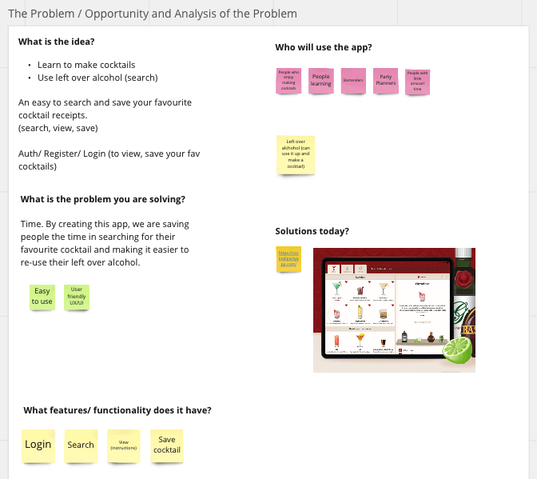

#  My Cocktail App
**Project:** T3A2-A Full Stack App (Part A)

**Brief:** Design a web application (app) that solves a real life problem.

**Group Members:**

* Marion Akinyi
* Katrina Tomaszczyk

**Important Links:**

[Trello](https://trello.com/invite/b/bGaDJxU8/ATTI8ede4dc9eb69ccd7f3c83fc1213fe4b54F7075F6/t3a2-mern-app-part-a)

[Miro](https://miro.com/app/board/uXjVPzbXD88=/)
________________________________________________________________

## Table of Contents

[My Cocktail App](#mycocktail)
1. [Introduction](#introduction)
2. [Dataflow Diagram](#dataflow)
3. [Application Architecture Diagram](#architecture)
4. [User Stories](#userstories)
5. [Wireframes](#wireframes)
6. [Product Tracking - Trello](#trello)

[Product Development](#productdevelopment)
1. [Ways of Working](#working)
2. [Brainstorming](#brainstorming)
3. [Defining the problem](#problem)
4. [User Story Mapping](#storymapping)
5. [Analysis](#analysis)

# My Cocktail App

# Introduction
The purpose of **My Cocktail App** is to develop a Wiki app guide to making classic and modern cocktails. Using the  cocktail databaseb API. It features a database with  lists  of ingredients for each cocktail recipe, allowing users to quickly find the ingredients they need to craft a particular drink, by filtering using alcohol type and name of cocktail.

**Target Audience:**

This app is targeted to  home bartenders, cocktail enthusiasts and professional bartenders.

**Customer-facing Frontend:**

- A search bar designed to help users quickly find cocktails and recipes by name or ingredient or even by type of spirit.
- Display list of cocktails
- A “favourites” section where users can save their favourite recipes for easy access later.
- Display ingredients and detailed  recipes  of cocktails

**The API Backend:**

- Users (login/register)
- Authentication to delete/ view  saved recipes
- View My Saved Cocktails

**Tech Stack:**

* Mongo / Mongoose
* Express JS
* React 
* Node JS

# Dataflow Diagram

Add diagram here....

# Application Architecture Diagram

Add Architecture diagram here

# User Stories

Add user stories here

# Wireframes

Add Wireframes here

# Product Tracking - Trello

**Day 1: Trello Screenshot**

**Notes:**
* Official day of starting My Cocktail App as a Team. 
* Previously set up ways of working with Team expectations
* Monday the 16th of Jan - Review and update wireframe concept
* Tech investigation of API/ Architectural design investigation of Tech Stack

In the above screenshot, together as a Team we brainstormed and decided on the purpose/ features/ components/ target audience and tech stack. 

# Product Development

Below are the steps as a Team we took to help us understand the following:

* How to effectively work as a Team
* Product Delivery methodologies
* Understand the problem we are solving 
* Product analysis methods
* Identify target audience for this application
* Tech investigations to make sure we are using the correct tech stack / components

# Ways of Working

Ways of working is how a team collaborates. It should lead to connection, belonging, trust, speed, and momentum, all outcomes of successful team engagement.

We used the ways of working to help us understand our responsibilities in the team. This included understanding our strengths and weakenesses as well as knowing that open communication and collaboration are our foundations. 

**Notes:**

Discussed together 
* (Yes) Daily Check In (Discord) 
* (Yes) Every second day a virtual meeting (15/30 minutes to overview where we are at)?
* Task allocation (When we need to do a task, discuss together)

**Agile Methodology**

Kanban. Take a task as we need to do it. 
“Kanban is a popular framework used to implement agile and DevOps software development. It requires real-time communication of capacity and full transparency of work. Work items are represented visually on a kanban board, allowing team members to see the state of every piece of work at any time.”

- This is how we set up the initial Trello Board. Wrote all the intial tickets and into a backlog/ to do column that we can all see and track. 

# Brainstorming

Together we dicussed and used a virtual white board to brainstorm an idea. 

From the original idea, we dicussed features and functionality. We wanted to ensure we had a problem to solve and we did this through further competitor analysis. 

# Defining the problem

From this acitivity, we knew that we were solving a problem to help customers save time in planning a making and making a delicious cocktail. 

We also knew that we were targeting customers who struggle to find a good cocktail receipe online. This is why we wanted focus on the search functionality as part of the MVP (Minimal Viable Product). 

# User Story Mapping

1. Define a user: We used the name Tom who is planning a party.
2. Follow Tom's journey on how we would use the app.

From the initial story mapping of one user. We realised that the first thing a customer wants to do is Search. This validated our original problem. 

We tested this theory by using competitors online who have a similar application to searching and making cocktails. 

# Analysis

Product analysis is “the process of gathering, defining, and analyzing data about a product or service to make better decisions.” To create products that fit the needs of your target market, you need to have a clear understanding of what those needs are. This is where product analysis comes in.

* Competitor analysis
* UX/UI investigations

